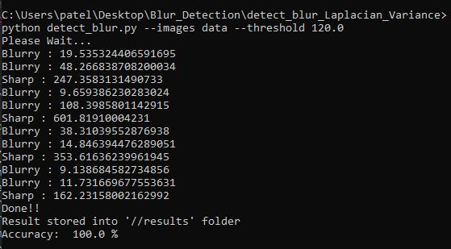

# Blur Detection in Images Using Opencv-python

## How to run code

### Step:1
- clone this repository and go to the `detect_blur_Laplacian_Variance` directory in command prompt

### Step:2

- **Install the dependencies from following command**

    > pip3 install -r requierments.txt

### Step:3 
- **Program Execution**

    Then run `detect_blur.py` file using following command.
    
    > `python detect_blur.py --images images [--threshold 120.0]`
    
    short command | full command  | Description | default |
    | -- | -- | -- | -- |
    | -i | --images | path to input directory of images |
    | -t | --threshold | focus measures that fall below this value will be considered 'blurry' | 100.0 |
    
    **NOTE**:
    - **for less input images use `--images data` instead of --images images**

### Sample Output

### json Preview

